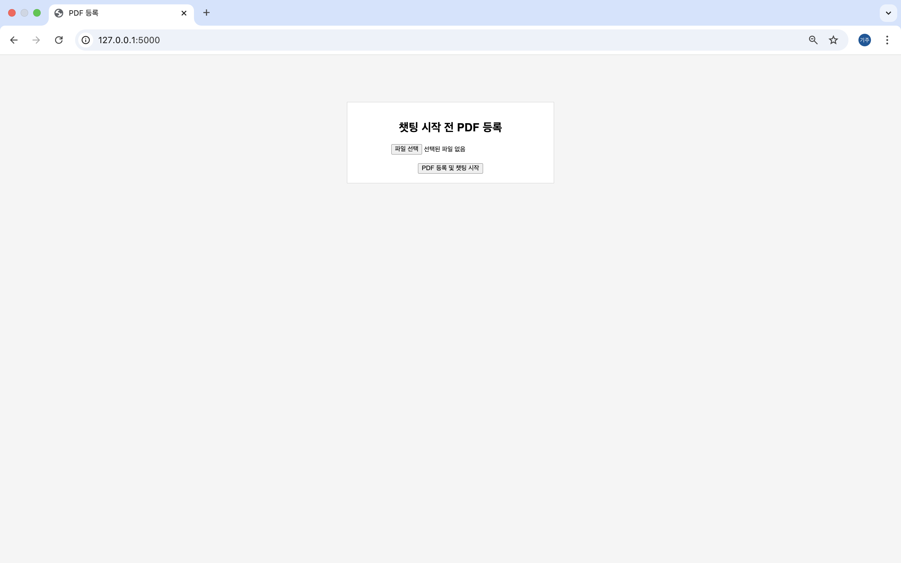
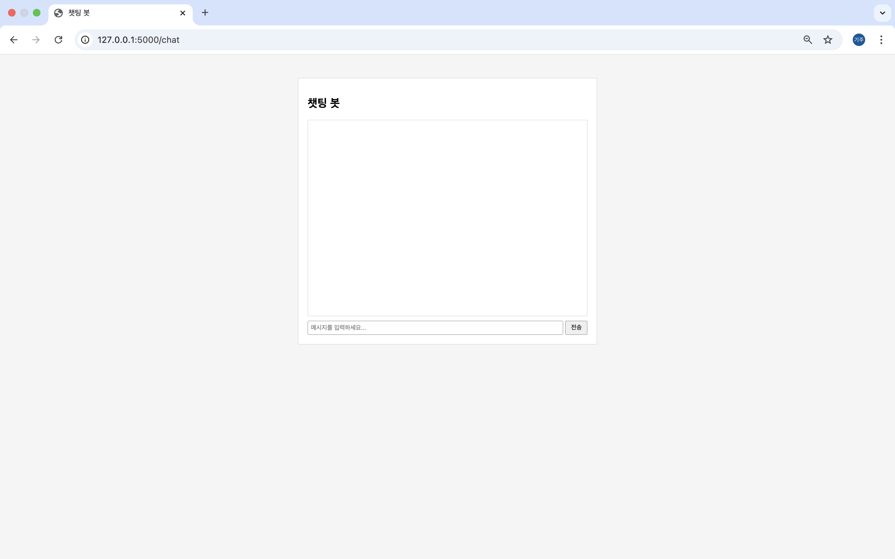
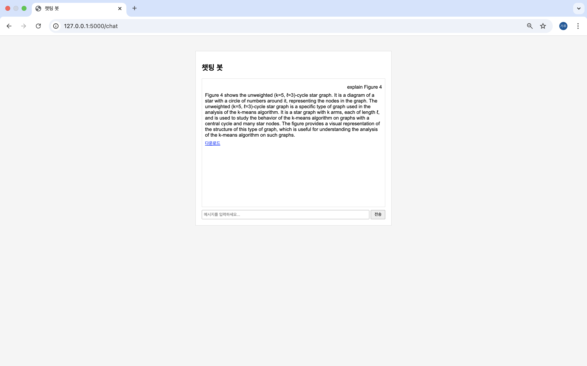
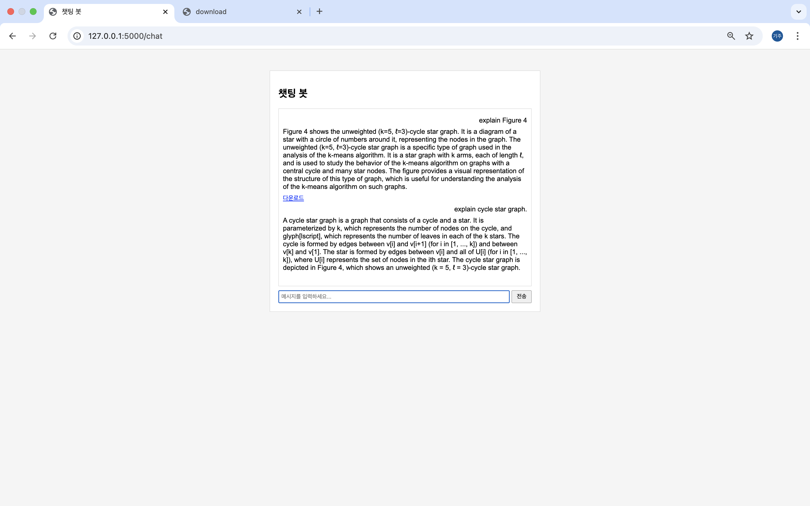
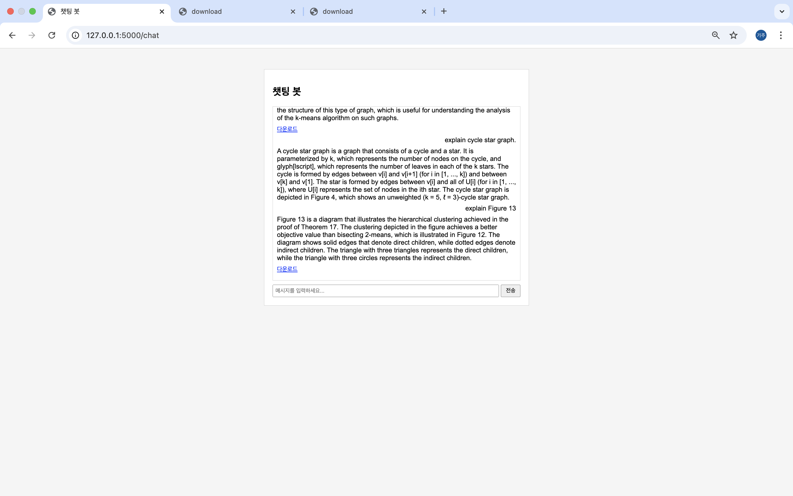
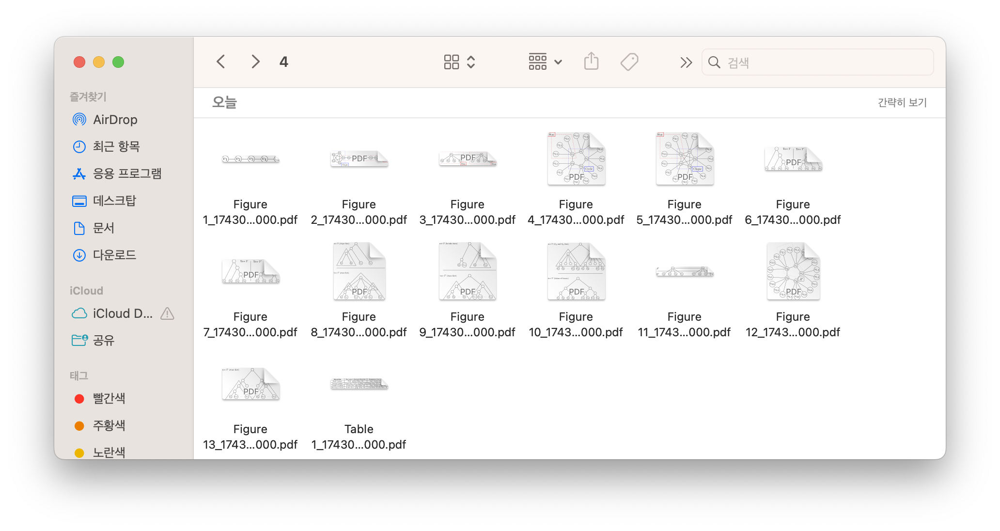

# PDF 기반 RAG 파이프라인 및 클러스터링 기반 비텍스트 요소 추출 시스템

이 프로젝트는 PDF 문서 내의 텍스트와 비텍스트(이미지, 도형 등) 정보를 효과적으로 추출 및 분석하여, 질문-응답 시스템(Retrieval Augmented Generation, RAG) 및 이미지 캡셔닝 기능과 통합한 플랫폼입니다. 특히, 기존 OCR 방식이 아닌 자체 개발한 클러스터링 기법을 통해 PDF의 비텍스트 요소를 데이터 값으로 추출하고, 이를 벡터 스토어 및 SQL 데이터베이스에 저장하여 활용하는 점이 주요 특징입니다.

---

## 주요 특징

- **PDF 업로드 및 처리**  
  - **Flask 웹 인터페이스**를 통해 사용자가 PDF 파일을 업로드하면, 파일을 지정된 폴더에 저장한 후 내부의 텍스트와 비텍스트 요소를 추출합니다.
  - **자체 개발한 c.py 모듈**을 사용해 PDF 내의 비텍스트 요소(이미지, 드로잉 등)를 좌표 기반으로 추출하고, 인접한 요소들을 클러스터링 및 그룹화하여 하나의 영역으로 병합합니다.
  - 이 과정에서 각 클러스터 영역은 별도의 PDF 및 PNG 파일로 저장되며, 해당 정보는 SQL 데이터베이스에 기록되어 추후 분석 및 검색에 활용됩니다.

- **텍스트 및 캡션 분석**  
  - PDF 문서의 텍스트 블록을 분석하여 캡션(예: Figure, Table)을 검출하고, 캡션 영역과 비텍스트 클러스터 영역을 1:1 매칭하는 DFS 기반의 매칭 알고리즘을 적용합니다.
  - 추출된 캡션과 영역은 시각적으로 PDF 파일 내에 표시되며, 최종 결과물이 클러스터링 및 캡션 정보를 포함한 PDF로 생성됩니다.

- **RAG 파이프라인 및 질문-응답 기능**  
  - LangChain과 Milvus 벡터 스토어를 활용하여 PDF 내 텍스트 및 추가 문서(캡션, 비텍스트 영역 정보)를 임베딩하고, 사용자의 자연어 질문에 대해 관련 문맥을 검색하여 응답을 생성합니다.
  - HuggingFace의 언어 모델(예: mistralai/Mixtral-8x7B-Instruct-v0.1)을 통해 질문에 대한 답변을 생성하며, PDF 내 Figure 및 클러스터 영역 정보와 매칭된 결과를 제공합니다.

- **이미지 캡셔닝**  
  - Salesforce의 BLIP 모델을 활용하여 PNG 이미지 파일에 대해 자동 캡션을 생성합니다.
  - 이미지 캡셔닝 결과는 추출된 비텍스트 영역의 시각적 정보를 보완하는 역할을 하며, SQL에 저장된 메타데이터와 함께 관리됩니다.

---

## 예제 논문 선정 이유
  
- **주요 내용**
   - 계층적 군집화는 데이터 분석에서 오랫동안 사용되어 왔으나, 이론적으로 명확한 목적 함수와 성능 보장이 부족했습니다. 본 논문은 Dasgupta (2016)의 cost objective를 기반으로 한 dual reward objective를 도입하여, 알고리즘들이 어떤 목표를 최적화하는지 분석하고, 서로 다른 방법들의 성능을 비교합니다.
     
- **논문 특징**
   - 비 텍스트 요소(선, 원등)를 활용해 개념을 설명하기 때문에 기존 ai에서 해당 부분을 출력하는데 어려움을 겪음.
  
---

## 시스템 구성

- **백엔드**  
  - **Flask**: 웹 서버 및 파일 업로드, 세션 관리, 채팅(질문-응답) 인터페이스 제공
  - **MySQL**: PDF 문서 및 캡션, 영역 정보 저장
  - **Milvus**: 임베딩 벡터를 저장하고 유사도 검색을 지원하는 벡터 스토어
  - **Docker**: Milvus를 운영하기 위한 가상 리눅스 공간

- **PDF 처리 및 비텍스트 추출 (c.py)**  
  - **PyMuPDF(fitz)**: PDF 파일의 읽기 및 조작, 이미지/도형 영역 추출
  - **https://github.com/kiju2912/pdf_parser**:
  -   
    - 텍스트 블록 분석, 캡션(figure/table) 검출  
    - 비텍스트 요소의 클러스터링 및 그룹화 (인접 요소 합치기, 겹침 영역 처리 등)
    - 클러스터 영역과 캡션 매칭, 별도 PDF/PNG 파일 저장 및 SQL 저장

- **자연어 처리 및 RAG (lang_pipe_line.py) 파이프라인**  
  - **LangChain**: 질문-응답 체인 구성 및 문서 청킹
  - **HuggingFace 모델**: 언어 모델을 통한 응답 생성 (예: Mixtral-8x7B-Instruct-v0.1[docling])

- **이미지 캡셔닝 (image_caption.py)**  
  - **BLIP 모델 (Salesforce)**: 추출된 영역을 이미지로 전환 해 해당 영역의 생김을 묘사합니다.
  - ex:
    - File: Figure 2_1743059622915256000.png, Caption: a diagram of a single - line network
    
    

---

## 스크린샷

아래 스크린샷은 시스템의 주요 처리 결과 및 UI 구성 예시를 보여줍니다.  
(모든 이미지 파일은 `readme` 폴더 내에 있으며, 파일 이름은 아래와 같습니다.)

1. **시작화면**  
     
   - **설명:** PDF 업로드 전, 시스템 초기 상태를 보여주는 메인 화면입니다. "챗팅 시작 전 PDF 등록" 버튼을 통해 PDF 파일을 업로드할 수 있습니다.

2. **채팅 기본화면**  
     
   - **설명:** 챗봇(질문-응답) 인터페이스의 초기 상태로, 사용자가 질문을 입력하면 채팅창에 답변이 표시됩니다.

3. **Figure 관련 질문 1**  
     
   - **설명:** “Figure 4”에 대해 질문하는 장면으로, 시스템이 해당 영역과 관련된 정보를 검색하여 답변을 생성하는 과정을 보여줍니다.
   - **설명:** matadata의 source의 값에 output이 포함되어있을 경우 해당 부분을 다운 받을 수 있게 준비합니다.
     
4. **탐색된 Figure 4**  
   .png)  
   - **설명:** 업로드된 PDF에서 “Figure 4”가 검색되어 해당 영역을 별도로 추출 및 PDF로 변환한 결과입니다.

5. **일반 질문**  
     
   - **설명:** 업로드된 PDF 문서에 대해 사용자 질문을 입력한 화면입니다.
  
6. **Figure 관련 질문 2**  
     
   - **설명:** “Figure 13” 등 다른 Figure에 대해 추가 질문을 하는 화면입니다.
   - **설명:** matadata의 source의 경로가 output일 경우 해당 부분을 다운 받을 수 있게 준비합니다.
     
7. **탐색된 Figure 13**  
   .png)  
   - **설명:** “Figure 13” 부분을 찾아 별도의 PDF로 추출한 결과입니다.

8. **추출된 영역들**  
     
   - **설명:** PDF 파일에서 분석된 이미지 및 표, 캡션 등을 별도의 PDF/PNG 파일로 분할하여 추출한 결과입니다.
  
     
---

## 설치 및 실행 방법

1. **환경 설정 및 의존성 설치**  
   - Python 3.x 환경에서 가상환경을 생성한 후, 아래와 같이 필요한 패키지를 설치합니다.
     ```bash
     pip install flask flask-cors mysql-connector-python python-dotenv pymupdf pillow transformers langchain
     ```
   - Milvus 서버와 MySQL 데이터베이스가 사전에 설치 및 설정되어 있어야 합니다.
   - HuggingFace API 토큰 및 기타 환경 변수는 `.env` 파일에 설정합니다.

2. **프로젝트 실행**  
   - **Flask 웹 서버 실행 (PDF 업로드 및 질문-응답 기능):**
     ```bash
     flask run --debug
     ```
   - **PDF 처리 파이프라인 실행 (c.py 모듈):**  
     - `python app.py` 또는 `python c.py` (메인 함수 호출)을 통해 데이터 폴더 내 PDF 파일들을 처리하고, 결과물을 `output/pdf` 및 `output/png`에 저장합니다.
   - **이미지 캡셔닝 테스트:**  
     ```bash
     python image_caption.py
     ```

3. **사용 방법**  
   - 웹 브라우저에서 Flask 앱의 기본 URL에 접속하여 PDF 파일을 업로드합니다.
   - 업로드된 PDF 파일은 내부의 텍스트와 비텍스트 요소가 처리된 후, 클러스터링된 영역 및 캡션 정보를 포함한 PDF와 PNG 파일로 저장됩니다.
   - SQL 데이터베이스에 PDF, 캡션 및 영역 정보가 저장되어 추후 벡터 스토어(또는 RAG 파이프라인)에서 활용됩니다.
   - 채팅 인터페이스를 통해 사용자가 질문하면, RAG 파이프라인이 PDF 내 관련 문맥을 검색하여 자연어 응답을 제공합니다.

## sql db
 ```bash
   CREATE TABLE `area` (
  `area_id` int NOT NULL AUTO_INCREMENT,
  `caption_id` int DEFAULT NULL,
  `pdf_file_name` text,
  `png_file_name` text,
  `page_number` int NOT NULL,
  `x0` double DEFAULT NULL,
  `y0` double DEFAULT NULL,
  `x1` double DEFAULT NULL,
  `y1` double DEFAULT NULL,
  `type` enum('figure','table') NOT NULL,
  `appearance_description` text,
  PRIMARY KEY (`area_id`),
  KEY `caption_id` (`caption_id`),
  CONSTRAINT `area_ibfk_1` FOREIGN KEY (`caption_id`) REFERENCES `captions` (`caption_id`) ON DELETE SET NULL
) ENGINE=InnoDB AUTO_INCREMENT=2317 DEFAULT CHARSET=utf8mb4 COLLATE=utf8mb4_0900_ai_ci

CREATE TABLE `captions` (
  `caption_id` int NOT NULL AUTO_INCREMENT,
  `caption_name` text,
  `pdf_id` int NOT NULL,
  `page_number` int NOT NULL,
  `caption_text` text,
  `x0` double DEFAULT NULL,
  `y0` double DEFAULT NULL,
  `x1` double DEFAULT NULL,
  `y1` double DEFAULT NULL,
  PRIMARY KEY (`caption_id`),
  KEY `pdf_id` (`pdf_id`),
  CONSTRAINT `captions_ibfk_1` FOREIGN KEY (`pdf_id`) REFERENCES `pdf_documents` (`pdf_id`) ON DELETE CASCADE
) ENGINE=InnoDB AUTO_INCREMENT=5028 DEFAULT CHARSET=utf8mb4 COLLATE=utf8mb4_0900_ai_ci

CREATE TABLE `pdf_documents` (
  `pdf_id` int NOT NULL AUTO_INCREMENT,
  `file_name` text NOT NULL,
  `processed_date` datetime DEFAULT CURRENT_TIMESTAMP,
  PRIMARY KEY (`pdf_id`)
) ENGINE=InnoDB AUTO_INCREMENT=378 DEFAULT CHARSET=utf8mb4 COLLATE=utf8mb4_0900_ai_ci
```
---

## 향후 개선 방향

- **질문-응답 모델의 정밀도 향상**  
  - 더 강력한 언어 모델 및 프롬프트 튜닝을 통해 응답의 정확도와 관련성을 높임.
  
- **UI/UX 개선**  
  - 사용자 친화적인 프론트엔드 인터페이스 및 실시간 결과 표시 기능 추가.
  
- **다양한 문서 포맷 지원**  
  - PDF 외 다른 문서 포맷 지원 및 다양한 데이터 소스 연동.
  
- **클러스터링 알고리즘 최적화**  
  - 비텍스트 요소의 클러스터링 및 매칭 알고리즘 개선을 통한 처리 속도 및 정확도 향상.
  
- **시스템 배포**  
  - Docker 컨테이너화 및 클라우드 환경으로의 배포를 통한 운영 효율성 강화.

---

## 결론

이 프로젝트는 전통적인 OCR 방식에 의존하지 않고, PDF 문서 내의 비텍스트 요소를 클러스터링과 그룹화를 통해 구조적으로 추출하는 새로운 접근법을 제시합니다. 텍스트와 비텍스트 정보를 통합 관리함으로써, 학술 논문이나 복잡한 문서의 내용을 심층적으로 분석하고, 자연어 질문-응답 시스템 및 이미지 캡셔닝 기능과 결합하여 더욱 풍부한 정보를 제공합니다. 이를 통해 포트폴리오 및 연구 데모로 활용할 수 있는 문서 분석 플랫폼을 구현하였습니다.
EOF
