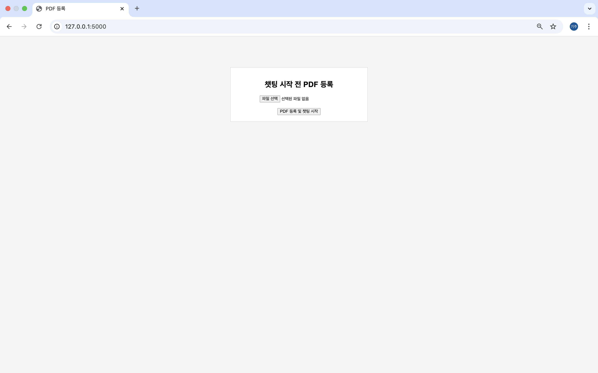
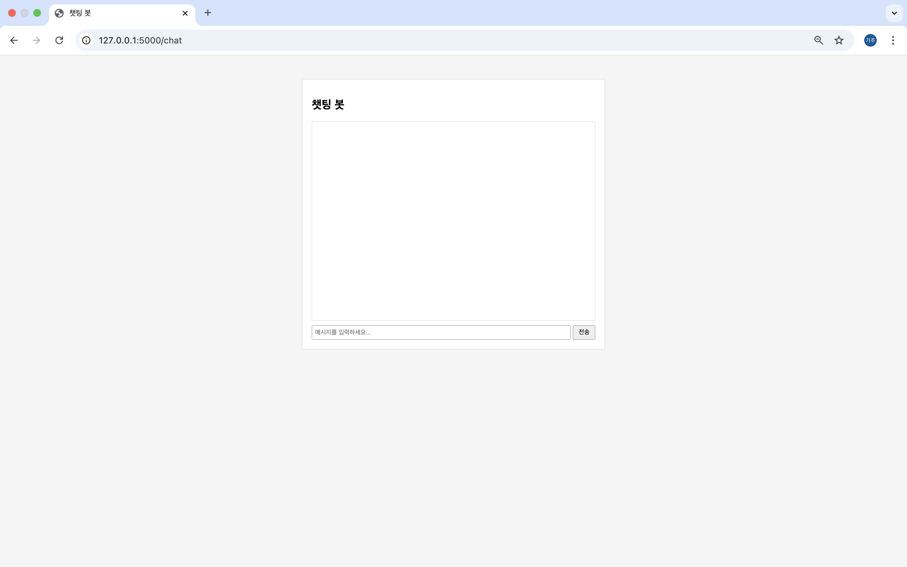
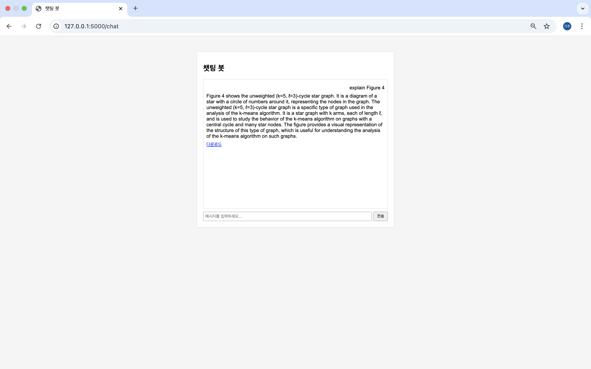
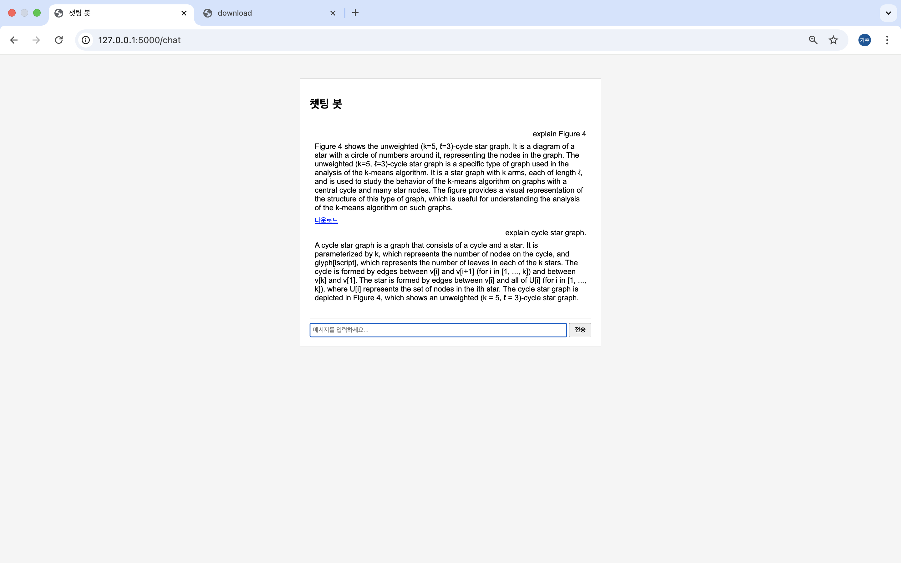
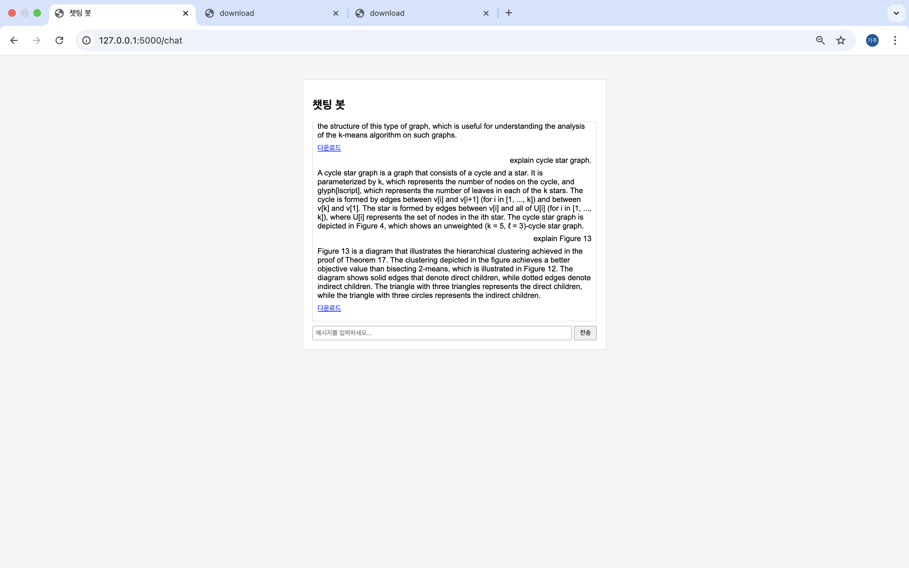
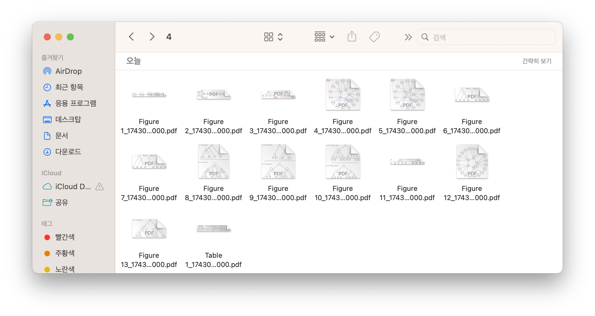

# PDF-based RAG Pipeline and Clustering-Based Non-Text Element Extraction System

This project is a platform that effectively extracts and analyzes both textual and non-textual (e.g., images, diagrams) information from PDF documents. It integrates a Retrieval Augmented Generation (RAG) question-answering system and image captioning functionalities. Notably, instead of relying on traditional OCR, it utilizes a custom clustering algorithm to extract non-text elements from PDFs, storing them in a vector store and SQL database for further usage.

---

## Key Features

- **PDF Upload and Processing**  
  - Users can upload PDF files via a **Flask web interface**, which saves the file and processes its textual and non-textual elements.
  - A custom `c.py` module extracts non-textual elements (images, drawings, etc.) based on their coordinates and merges adjacent elements into unified clusters.
  - Each cluster region is saved as separate PDF and PNG files, with metadata stored in a SQL database for further analysis and retrieval.

- **Text and Caption Analysis**  
  - Text blocks in the PDF are analyzed to detect captions (e.g., “Figure”, “Table”), which are then matched to the nearest non-textual clusters using a DFS-based matching algorithm.
  - These matched results are visually displayed within the PDF and saved as enhanced versions with cluster and caption annotations.

- **RAG Pipeline and Q&A System**  
  - Uses **LangChain** and **Milvus vector store** to embed both PDF text and additional content (captions and non-text clusters).
  - Natural language questions are answered by retrieving relevant context and generating responses using HuggingFace models (e.g., `mistralai/Mixtral-8x7B-Instruct-v0.1`).
  - Answers are context-aware and aligned with visual figures and extracted clusters.

- **Image Captioning**  
  - Utilizes Salesforce’s **BLIP model** to automatically generate captions for the PNG files extracted from non-text elements.
  - These captions supplement visual understanding and are managed alongside metadata in the SQL database.

---

## Selected Paper Example

  
- **Core Concept**
  - This paper analyzes hierarchical clustering algorithms based on Dasgupta's cost objective, introducing a dual reward objective to evaluate and compare different approaches.
- **Why This Paper**
  - Rich use of non-textual components (lines, shapes, diagrams), which traditional AI systems struggle to process and represent properly.

---

## System Architecture

- **Backend**  
  - **Flask**: Web server, file upload, session management, chat interface  
  - **MySQL**: Stores PDF documents, captions, and cluster region information  
  - **Milvus**: Vector database for embeddings and similarity search  
  - **Docker**: Used for managing the Milvus environment

- **PDF and Non-Text Element Extraction (c.py)**  
  - **PyMuPDF (fitz)**: Reads and manipulates PDF files, extracts shapes/images  
  - **Custom PDF Parser** ([[github.com/kiju2912/pdf_parser](https://github.com/kiju2912/pdf_parser)](https://github.com/kiju2912/pdf_parser/blob/main/README_en.md))  
      
    - Text block and caption detection  
    - Clustering/grouping of non-textual elements (merging overlapping or nearby elements)  
    - Matching clusters with captions, saving results as separate PDF/PNG files, and recording in SQL

- **Natural Language Processing (lang_pipe_line.py)**  
  - **LangChain**: Constructs document chains and manages chunking  
  - **HuggingFace Models**: Generates answers from retrieved contexts (e.g., Mixtral-8x7B-Instruct-v0.1)[docling](https://arxiv.org/pdf/2408.09869)

- **Image Captioning (image_caption.py)**  
  - **BLIP model (Salesforce)**: Generates visual descriptions for extracted image regions
  - ([[BLIP](https://arxiv.org/pdf/2201.12086))]
  - Example:  
    - 
    - Caption: *"A diagram of a single-line network"*

---

## Screenshots

Images are located in the `readme` directory. Below are key examples:

1. **Start Screen**  
     
   - Shows the main interface before PDF upload

2. **Chat Interface**  
     
   - Default chat interface before a question is asked

3. **Figure Query Example 1**  
     
   - Question about “Figure 4”, with system retrieving relevant area and answering

4. **Figure 4 Detection**  
   .png)

5. **General Q&A**  
   

6. **Figure Query Example 2**  
   

7. **Figure 13 Detection**  
   .png)

8. **Extracted Regions**  
   

---

## Installation & Setup

1. **Environment Setup & Dependency Installation**
   ```bash
   pip install flask flask-cors mysql-connector-python python-dotenv pymupdf pillow transformers langchain
   ```
   - Make sure **Milvus** and **MySQL** servers are installed and running.
   - Use `.env` to store HuggingFace tokens and other environment variables.

2. **Run the Project**
   - **Start Flask Web Server:**
     ```bash
     flask run --debug
     ```
   - **Execute PDF Processor (`c.py` or `app.py`):**
     ```bash
     python app.py
     # or
     python c.py
     ```
   - **Run Image Captioning:**
     ```bash
     python image_caption.py
     ```

3. **How to Use**
   - Upload a PDF via the browser.
   - The system processes text and non-text elements, clusters them, and stores metadata.
   - Query the document via chat to receive intelligent, context-aware answers using the RAG pipeline.

---

## SQL Schema
```sql
CREATE TABLE `area` (
  `area_id` int NOT NULL AUTO_INCREMENT,
  `caption_id` int DEFAULT NULL,
  `pdf_file_name` text,
  `png_file_name` text,
  `page_number` int NOT NULL,
  `x0` double DEFAULT NULL,
  `y0` double DEFAULT NULL,
  `x1` double DEFAULT NULL,
  `y1` double DEFAULT NULL,
  `type` enum('figure','table') NOT NULL,
  `appearance_description` text,
  PRIMARY KEY (`area_id`),
  KEY `caption_id` (`caption_id`),
  CONSTRAINT `area_ibfk_1` FOREIGN KEY (`caption_id`) REFERENCES `captions` (`caption_id`) ON DELETE SET NULL
);

CREATE TABLE `captions` (
  `caption_id` int NOT NULL AUTO_INCREMENT,
  `caption_name` text,
  `pdf_id` int NOT NULL,
  `page_number` int NOT NULL,
  `caption_text` text,
  `x0` double DEFAULT NULL,
  `y0` double DEFAULT NULL,
  `x1` double DEFAULT NULL,
  `y1` double DEFAULT NULL,
  PRIMARY KEY (`caption_id`),
  KEY `pdf_id` (`pdf_id`),
  CONSTRAINT `captions_ibfk_1` FOREIGN KEY (`pdf_id`) REFERENCES `pdf_documents` (`pdf_id`) ON DELETE CASCADE
);

CREATE TABLE `pdf_documents` (
  `pdf_id` int NOT NULL AUTO_INCREMENT,
  `file_name` text NOT NULL,
  `processed_date` datetime DEFAULT CURRENT_TIMESTAMP,
  PRIMARY KEY (`pdf_id`)
);
```

---

## Future Improvements

- **Enhanced QA Accuracy**  
  - Improve prompt engineering and adopt more robust language models

- **Better UI/UX**  
  - Add real-time visual feedback and user-friendly frontend

- **Support for More Formats**  
  - Beyond PDF, support DOCX, HTML, etc.

- **Clustering Optimization**  
  - Further refine clustering algorithms for higher speed and precision

- **Deployment**  
  - Package using Docker and deploy on cloud for scalability

---

## Conclusion

This project introduces a novel approach to structured extraction of non-textual elements from PDFs without relying on traditional OCR. By combining textual and visual information, it offers a powerful document understanding system ideal for research, academic papers, and intelligent question-answering applications.
